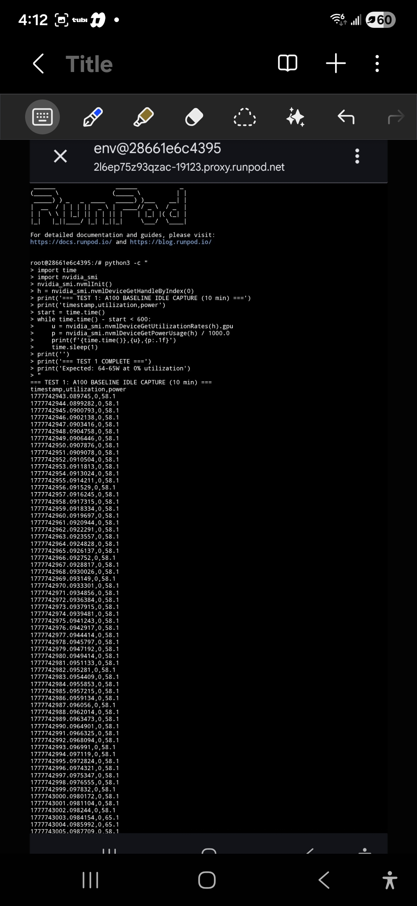

# Test 1: A100 Idle Baseline

## Results
- **Power:** 58.1W (typical), range 57.7-58.1W
- **Utilization:** 0%
- **Duration:** 10 minutes

## Key Finding
Power remained stable at 58.1W. Brief anomaly spike to 68.5W at 0% utilization observed (early ghost power indication).

## Screenshot

## Status
Complete
